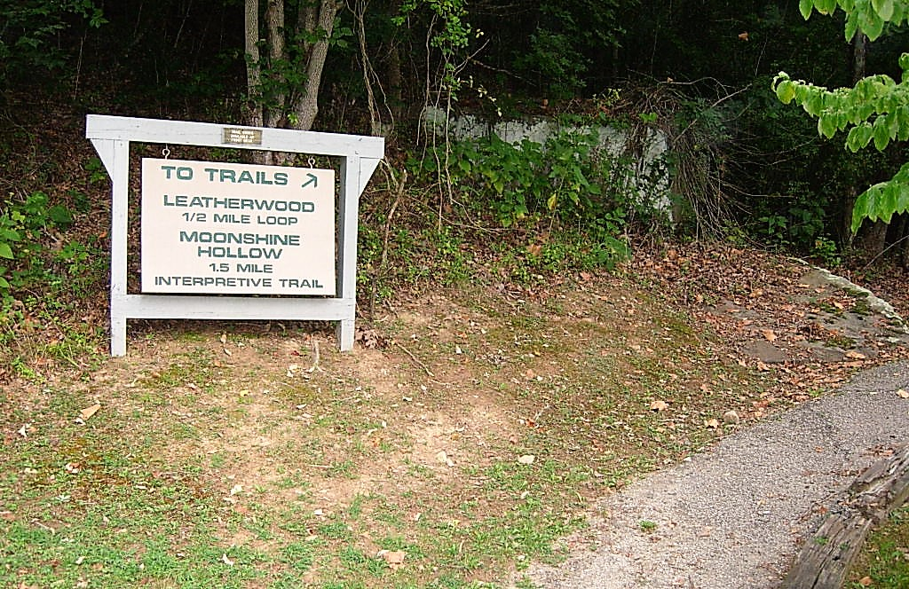

# geoVisCollab2
## Second Collaborative Geovisualization Project
### Campsites of Kentucky by Physiographic Region

 
**Figure 1**. A Campsite Trailhead. Image: Kentucky State Parks.

###### Data Sources:

 **Kentucky State Parks Campsites** (Kentucky State Parks Campsites.shp) courtesy of [Kentucky Department of Parks](ftp.kymartian.ky.gov/kyparks/Kentucky State Parks Campsites.zip), License:   [License Free Government Work](http://kygisserver.ky.gov/geoportal/catalog/content/disclaimer.page).  Acquired as ZIP.  Download winzip so unzip is available in the command line and unzip. Use ogrinfo to learn the data is in NAD 83 StatePlane Kentucky.  Use ogr2ogr to convert to WGS 84. Use mapshaper to convert to GeoJSON, reduce coordinate precision, and filter fields. Check output using geojson.io. 

 **Physiographic Regions** (Physiographic_Regions.shp) courtesy of [Kentucky Geological Survey (KGS)](http://kgs.uky.edu/kgsweb/download/state/REGIONS.ZIP), License:   [License Free Government Work](http://kygisserver.ky.gov/geoportal/catalog/content/disclaimer.page).  Acquired as ZIP.  Download winzip so unzip is available in the command line and unzip.  Use ogrinfo to learn the data is in NAD 83 StatePlane Kentucky.  Use ogr2ogr to convert to WGS 84.  Use mapshaper to convert to GeoJSON and reduce coordinate precision.  Check output using geojson.io. QGIS used to count points in polygon. Used custom javascript application to extract safecolors.json color blind friendly color scheme. 
